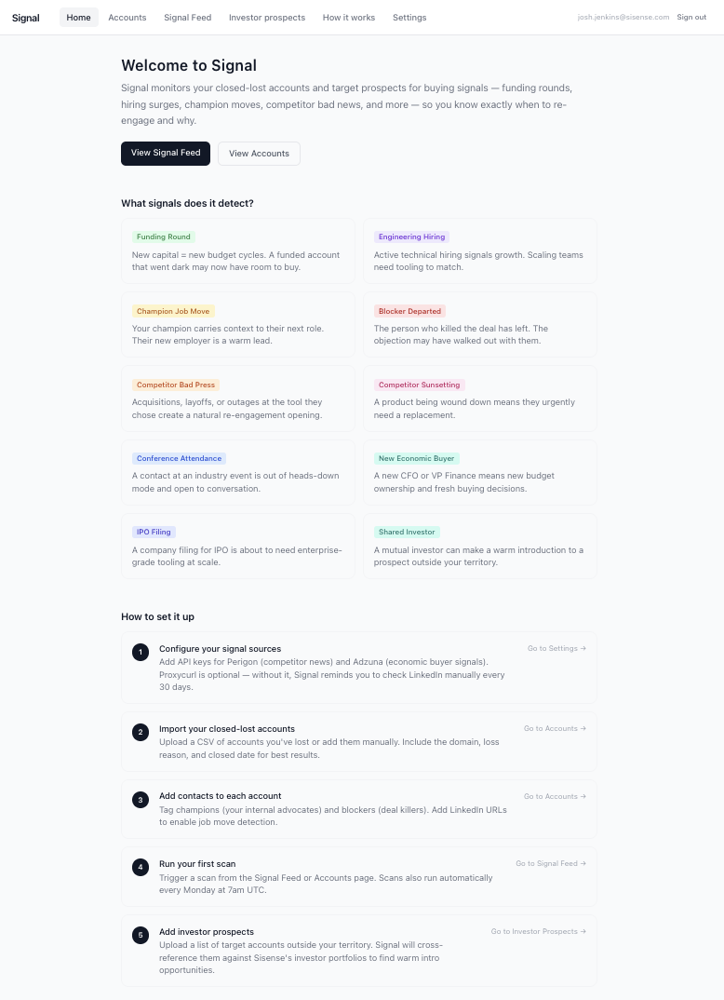

# Signal — Intent Signal Tracker

B2B sales tool that monitors closed-lost accounts and target prospects for re-engagement signals. Tracks funding rounds, hiring surges, champion moves, competitor bad news, IPO filings, and more — surfacing the right moment to reach back out.

## Screenshot



## Stack

- **Frontend**: React + Tailwind → Vercel
- **Backend**: Node.js + Express → Render
- **Database**: Supabase (Postgres + Auth)
- **Enrichment**: Crunchbase, Proxycurl (optional), Perigon (optional), Adzuna (optional)

## Pages

| Page | Route | Description |
|------|-------|-------------|
| Home | `/` | Overview of what Signal does and setup guide |
| Signal Feed | `/signals` | All signals across accounts, filterable by status |
| Accounts | `/accounts` | Closed-lost and target accounts |
| Account Detail | `/accounts/:id` | Signals, contacts, and scan history for one account |
| Investor Prospects | `/investor-prospects` | Accounts with shared Sisense investors — warm intro leads |
| How it works | `/summary` | Signal type reference |
| Settings | `/settings` | API keys and conference URLs |

## Running locally

### Prerequisites

- Node.js 18+
- Supabase project (free tier)

### Setup

```bash
# Backend
cd backend
cp .env.example .env
# fill in env vars (see below)
npm install
npm run dev

# Frontend (separate terminal)
cd frontend
cp .env.example .env
# fill in env vars (see below)
npm install
npm run dev
```

## Environment variables

### Frontend (`frontend/.env`)

| Variable | Description |
|----------|-------------|
| `VITE_API_URL` | Backend URL (default: `http://localhost:3001`) |
| `VITE_SUPABASE_URL` | Supabase project URL — Settings → API → Project URL |
| `VITE_SUPABASE_ANON_KEY` | Supabase anon/public key — Settings → API → Project API keys → `anon public` |

### Backend (`backend/.env`)

| Variable | Required | Description |
|----------|----------|-------------|
| `SUPABASE_URL` | Yes | Supabase project URL |
| `SUPABASE_SERVICE_KEY` | Yes | Service role key (never expose in frontend) |
| `SUPABASE_JWT_SECRET` | Yes | JWT secret — Settings → API → JWT Settings |
| `FRONTEND_URL` | Yes | Frontend origin for CORS (default: `http://localhost:5173`) |
| `OUR_CRUNCHBASE_PERMALINK` | No | Sisense's Crunchbase permalink — used for shared investor matching at import |
| `PROXYCURL_WEEKLY_CAP` | No | Max Proxycurl credits per weekly scan (default: `50`) |
| `PROXYCURL_MANUAL_CAP` | No | Max Proxycurl credits per manual scan (default: `10`) |
| `ADZUNA_MARKET` | No | Adzuna job market country code (default: `gb`) |

API keys for Crunchbase, Proxycurl, Perigon, and Adzuna are configured via the in-app Settings screen and stored in the `settings` DB table per user.

## Authentication

Signal uses Supabase Auth (email + password). All routes are login-protected. To create your first account: sign up via the login page, or create a user directly in the Supabase dashboard under **Authentication → Users**.

## Database

Apply migrations in order from `backend/supabase/` in the Supabase SQL editor (`migration_001.sql` through the latest).

## Signal sources

10 detectors run on demand — triggered manually from the Signal Feed or per-account page. 8 run in parallel per account; 3 Proxycurl detectors run sequentially to respect credit limits.

| Signal | Source | Notes |
|--------|--------|-------|
| `funding_round` | Crunchbase API | |
| `ipo_filing` | Crunchbase API | |
| `new_hire` | Account careers page (scraped) + Adzuna | |
| `new_economic_buyer` | Adzuna Jobs API | Senior finance/revenue hires |
| `conference_attendance` | Conference pages (configured in Settings) | |
| `champion_move` | Proxycurl LinkedIn API | Falls back to 30-day manual reminder |
| `blocker_departed` | Proxycurl LinkedIn API | Falls back to 30-day manual reminder |
| `competitor_bad_news` | Perigon News API | Uses per-account competitor or full Sisense list |
| `competitor_sunset` | Perigon News API | Uses per-account competitor or full Sisense list |
| `shared_investor` | Crunchbase API | Cross-references Sisense investor list |

### Competitors

Sisense's competitor list is hardcoded in `backend/src/lib/sisenseCompetitors.js` (Tableau, Power BI, Looker, Qlik, ThoughtSpot, MicroStrategy, Domo, GoodData, Omni, QuickSight, Embeddable, Luzmo, Sigma). Users can add custom competitors per-account; these are stored in the `custom_competitors` table and merged with the hardcoded list at scan time.

### Proxycurl manual mode

Without a Proxycurl API key, Signal creates a "Check [Name]'s LinkedIn" reminder signal every 30 days for each champion and blocker contact that has a LinkedIn URL. This ensures job moves are still caught manually.

## Scan API

| Endpoint | Body | Description |
|----------|------|-------------|
| `POST /api/accounts/:id/scan` | — | Scan a single account |
| `POST /api/scan/all` | `{ confirm: true, account_type: "closed_lost" \| "territory" \| "all" }` | Scan accounts by type — returns 409 if a scan is already running |
| `GET /api/scan/progress` | — | Returns `{ inProgress, current, total, currentAccount }` — poll during a scan for live progress |
